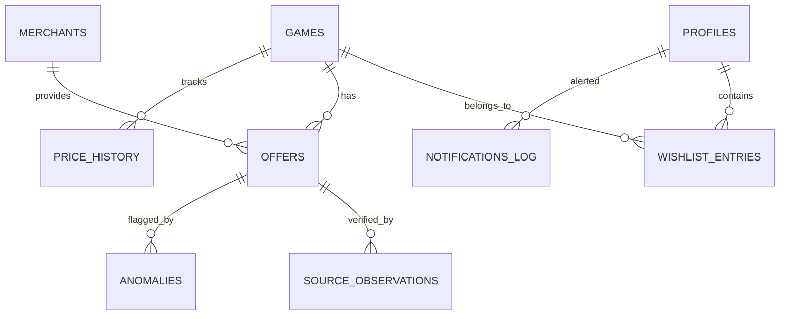

# 🎮 PriceSteamTool — Complete Architectural & System Summary

> **Session Handover Document**  
> **Repository:** [LoginRs99/PriceSteamTool](https://github.com/LoginRs99/PriceSteamTool)  
> **Version:** 1.7.0  
> **Last Updated:** 2026-08-19  
> **Test Status:** 20 Test Suites / 204 Tests Passing (100% Green), TypeScript Strict Clean (`tsc --noEmit`).

---

## 📌 1. Project Overview & Utility

**PriceSteamTool** is a self-hosted, privacy-first Steam Wishlist Price Aggregator and Deal Intelligence engine. It automatically syncs public/private Steam wishlists, cross-references multi-source retail & keyshop offers, computes statistical deal quality metrics, detects pricing glitches/anomalies, and dispatches rich Discord webhook deal alerts.

---

## 🏗️ 2. Technology Stack & Architecture

### Backend
- **Runtime:** Node.js 22+ with TypeScript (ES Modules).
- **Database:** SQLite via `better-sqlite3` with WAL mode enabled (`PRAGMA journal_mode = WAL`, `PRAGMA synchronous = NORMAL`, prepared statement caching via `prepareStmt`, composite indexing `idx_offers_game_valid_price`).
- **Web Server:** Fastify 5 REST API with Server-Sent Events (SSE) for live sync progress.
- **REST APIs:** `/api/*` (SPA internal) + `/api/v1/*` (Batch pricing & resolve endpoints).
- **Pacing & Resiliency:** Custom paced queues (`PacedSourceQueue`), random jitter, per-source Circuit Breakers, and exponential backoff retry handlers.

### Frontend
- **Framework:** React 18 with TypeScript.
- **Build Tool:** Vite.
- **Styling:** Custom Vanilla CSS design system (Tailwind-free) tailored for high density, dark-mode ergonomics, micro-interactions, responsive grid layouts, and modal dialogs.

---

## 📡 3. Data Sources & Adapters

| Source | Type | Endpoint / Mechanism | Features |
| :--- | :--- | :--- | :--- |
| **Steam Storefront** | Official Store | `store.steampowered.com/api/appdetails` | Base price, EUR sale price, discount %, metadata, header images. |
| **IsThereAnyDeal (ITAD)** | Aggregator / Official | ITAD API v2 (`lookup`, `overview`) | Official store network, verified historical lows (ATL), deal links, vouchers. |
| **CheapShark** | Aggregator / Official | CheapShark Batch API | Batch deal resolution, multi-store discounts, savings metrics. |
| **GG.deals** | Aggregator / Dual | GG.deals API & feeds | Keyshop + official price tracking, comparison links. |
| **AllKeyShop** | Keyshop Aggregator | Direct API (`vaks.php`, `price_history_api.php`) | Live keyshop comparisons, Kinguin, CDKeys, G2A, HRK, Instant-Gaming. |

---

## 🧠 4. Domain Engines & Algorithms

### A. Deal Score v2 Engine (`src/server/domain/dealScore.ts`)
Produces a normalized **0–100 monotonic score** rating the value of a deal relative to historical market behavior:
- **Z-Score & IQR Dispersion:** Evaluates current price against the 50th percentile (median) and Interquartile Range ($IQR = Q_3 - Q_1$). Effective standard deviation: $\sigma_{\text{effective}} = \max(IQR / 1.349, 0.50)$.
- **Sigmoid Curve:** Maps price distance into continuous probability distributions without arbitrary step cliffs.
- **Rarity & Anchor Bonus:** Grants up to +15 points for breaking All-Time Lows (ATL). Unconfirmed single-source keyshop ATLs receive a dampened bonus (50%).
- **Tiers:**
  - `EXCEPTIONAL` (85–100)
  - `GREAT` (70–84)
  - `FAIR` (50–69)
  - `MEH` (30–49)
  - `POOR` (0–29)
- **Provisional Mode:** When price history is sparse (< 3 observations), the deal is flagged `isProvisional: true` with capped score confidence.

### B. Data Confidence Scoring (`src/server/domain/dealScore.ts`)
Computes an independent **0–100% Data Confidence Score** based on:
- Sample size of historical sales observations.
- Timespan of tracking history (> 90d, > 365d).
- Cross-source merchant agreement count.
- Official vs unofficial merchant consensus.
- Tiers: `HIGH` ($\ge 75\%$), `MEDIUM` ($45-74\%$), `LOW` ($< 45\%$).

### C. Anomaly & Price Risk Engine (`src/server/domain/pricingEngine.ts`, `anomaly.ts`)
Prevents pricing glitches, mismatched game editions, or keyshop scams from polluting the top recommendations:
- **`LONE_BOTTOM_OUTLIER`**: Triggers if an offer is the cheapest live offer and $>50\%$ lower than the next-cheapest live offer ($P < P_{\text{second}} \times 0.55$).
- **`SUB_EURO_PREMIUM_GLITCH`**: Triggers if price is $< €1.00$ on high-MSRP games or $< 5\%$ of MSRP.
- **Capped Peer Divergence**: Median divergence and source disagreement are capped at 0.35 severity, preventing tight, legitimate keyshop clusters from being misflagged as HIGH RISK.
- **Data Safety Repository (`anomalyRepo`)**: Records anomalies with deduplication for auditing via the UI Data Safety tab.

### D. Action Signal Engine (`src/server/domain/actionSignal.ts`)
Calculates a direct recommendation badge for every game:
- `BUY_NOW`: Score $\ge 85$ with High/Medium Confidence and Safe/Low risk.
- `STRONG_BUY`: Score $\ge 70$ with verified price advantage.
- `FAIR_DEAL`: Moderate discount (Score 50–69).
- `WAIT`: Poor discount or high probability of deeper seasonal sale.
- `MONITOR`: Insufficient data confidence or provisional status.

### E. AllKeyShop Adaptive Pacing & Stealth System (`src/server/domain/allkeyshopScheduling.ts`, `allkeyshop.ts`)
Protects against unofficial API rate-limiting / IP bans without slowing down official sources:
- **Per-Game Due-Filtering (`isAllkeyshopDue`)**: Only games past their check interval are queried during sync.
- **Exponential Backoff (`computeNextInterval`)**:
  - Stable prices double interval: $24\text{h} \rightarrow 48\text{h} \rightarrow 96\text{h} \rightarrow 192\text{h} \rightarrow \max 336\text{h}$ (14 days).
  - Price fluctuation ($> €0.05$): Resets interval immediately to $24\text{h}$ floor and streak to $0$.
  - Target Price Pinning: If a game has an active Discord target price (`target_price_eur`), its interval is permanently clamped to the $24\text{h}$ floor.
- **Stealth Pacing:** 7,000ms base delay, 4,000ms jitter, 100,000ms chunk cooldown break every 30 games.
- **User-Agent Pool & Client Hints:** Rotates 6 realistic Chrome, Edge, Firefox, and Safari headers; omits `Sec-CH-UA` Client Hints on Firefox/Safari.

---

## 🗄️ 5. Database Schema Overview



### Key Tables & Features
- **`games`**: Stores metadata, historical low anchors (`historical_low_eur`, `atl_is_confirmed`, `atl_is_single_source_low`), statistical anchors (`typical_sale_median_eur`, `typical_sale_q1_eur`, `typical_sale_q3_eur`, `low_90d_eur`, `low_1y_eur`), and AllKeyShop adaptive state (`allkeyshop_last_checked_at`, `allkeyshop_check_interval_hours`, `allkeyshop_unchanged_streak`, `allkeyshop_last_price_eur`).
- **`offers`**: Live merchant offers with normalized pricing, `is_best_deal` flag (canonical single ranking query), `risk_level`, `risk_score`, `is_anomaly`.
- **`wishlist_entries`**: Maps profiles to games with priority, date added, and custom `target_price_eur`.
- **`merchants`**: Store registry (Official vs Keyshop flags, trust ratings).
- **`anomalies`**: Auditable pricing glitches for the Data Safety dashboard.
- **`notifications_log`**: Prevents duplicate Discord alerts within cooldown periods.

---

## 🔔 6. Discord Notification System (`src/server/domain/discordNotifier.ts`)

- **Configurable Filters:** Minimum Deal Score threshold, Minimum Confidence threshold, ATL-only toggle, Free games toggle, Target price alerts, Cooldown hours (default 24h).
- **Dual-Phase Dispatch:**
  1. **Phase 1 (Core Sync):** Dispatches alerts immediately after official / fast sources complete.
  2. **Phase 2 (Post-Enrichment):** Asynchronously dispatches a secondary alert pass after background AllKeyShop keyshop enrichment finishes (if new prices trigger deals), without blocking the main sync.

---

## 🧪 7. Test Suite & Verification

The project includes **20 test suites** with **200 automated tests** using Vitest:

| Test Suite | Focus Area | Test Count |
| :--- | :--- | :--- |
| `tests/unit/dealScore.test.ts` | Mathematical formulation, Z-score, sigmoid mapping, tiers | 46 tests |
| `tests/unit/pricingEngine.test.ts` | Multi-factor risk calculation, lone-bottom outliers, peer corroboration | 33 tests |
| `tests/unit/priceIntelligence.test.ts` | Statistical metrics calculation, historical anchor aggregation | 14 tests |
| `tests/unit/allkeyshopScheduling.test.ts` | Exponential backoff, round-robin due sorting, DB hydration, exponential jitter | 16 tests |
| `tests/unit/normalizer.test.ts` | Region codes, platform filtering, currency normalization | 12 tests |
| `tests/unit/discordNotifier.test.ts` | Alert criteria, target price overrides, provisional deals, embed formatting | 10 tests |
| `tests/unit/anomaly.test.ts` | Anomaly classifications, best deal gating, and edge cases | 9 tests |
| `tests/integration/v1Api.test.ts` | Batch offers, game resolve, ETag 304, alerts, merchants, rate limits | 7 tests |
| `tests/unit/actionSignal.test.ts` | BUY_NOW / STRONG_BUY / WAIT signal evaluations | 7 tests |
| `tests/unit/itad.test.ts` | ITAD API response parsing & conversion | 7 tests |
| `tests/integration/realWorldValidation.test.ts` | End-to-end sync, cache hit/miss, multi-merchant ranking | 7 tests |
| `tests/integration/finalSmokeAudit.test.ts` | Edge cases, Discord notification permutations, production integrity | 6 tests |
| `tests/integration/productionReadiness.test.ts` | Database schema migrations, index verification, rollback resilience | 6 tests |
| `tests/unit/v11_foundation.test.ts` | Database operations, data quality, multi-currency support | 5 tests |
| `tests/unit/circuitBreaker.test.ts` | Source fault tolerance, circuit trips, half-open states | 5 tests |
| `tests/unit/exchangeRate.test.ts` | FX rate conversions and caching | 4 tests |
| `tests/unit/cheapsharkBatch.test.ts` | CheapShark batch API chunking and response handling | 3 tests |
| `tests/unit/v12_features.test.ts` | Deal Score v2 feature regression tests | 3 tests |
| `tests/integration/csvExport.test.ts` | 14-column spreadsheet CSV export formatting and quoting | 2 tests |
| `tests/unit/freeGamesAndViewModes.test.ts` | 100% free giveaways and filter view modes | 2 tests |

---

## 🛠️ 8. Useful CLI Commands

```bash
# Typecheck TypeScript (Clean / Strict)
npm run typecheck

# Run full Vitest test suite (20 suites / 204 tests)
npm test

# Build client (Vite) and server (TypeScript)
npm run build

# Start local production server
npm start

# Run local development server
npm run dev
```

---

## 🚀 9. Current State & Recent Accomplishments (v1.7.0)

1. **Grouped Data Safety Review UI:** Implemented clean client-side card grouping in `AnomaliesView.tsx` with count and severity badges, multi-offer collapse toggles, and 1-click "Dismiss Game" batch dismissal while preserving the raw 1-row-per-offer audit log.
2. **AllKeyShop Stealth Pacing & Scheduling:** Added round-robin sorting of due games by `allkeyshop_last_checked_at` ascending, 30-game default volume cap, exponential-tailed jitter, and 5–15m natural hesitation pauses to eliminate robotic traffic patterns.
3. **Dead Historical Snapshot Protection:** Added 72h active observation window to AllKeyShop parser, preventing dead historical prices (e.g. on delisted titles) from overwriting live market prices.
4. **Strict DRM Store Isolation:** Explicitly excluded Epic Games Store, GOG, and non-Steam stores from being ingested as Steam keys.
5. **Database Startup Migrations:** Added safe `ALTER TABLE offers ADD COLUMN ...` migrations for `is_anomaly`, `anomaly_score`, and `anomaly_reason` to guarantee seamless upgrades for existing databases.
6. **v1 Anti-Rate-Limit REST API:** Created `/api/v1/offers/batch` (250-game multi-offer payload), `/api/v1/games/resolve` (bulk ID matching), ETag `304 Not Modified` caching, and RFC-compliant `X-RateLimit-*` headers.
7. **Complete 14-Column CSV Export:** Spreadsheet export at `GET /api/export/offers.csv` for in-depth price analysis.
